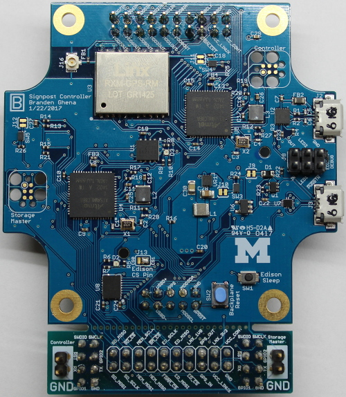

Control Module
=================

The Control Module is the brains of the Signpost. It contains two logical
units: the Controller and the Storage Master. The Controller is in charge of
isolation, initialization, energy monitoring and API, and time and location
APIs. The Storage Master is in charge of the SD card and storage API, as well
as managing an Intel Edison also on the Control Module. While the Intel Edison
is highly capable, its energy needs are too great to sustain always-on
operation on the Signpost. Instead, the Edison is thought of as a co-processor,
capable of occasional batch processing of data.

Physical Layout
---------------

### Main Header Signals

The Control Module has two headers that it uses to interact with the Backplane:
a 20-pin header on top and a 10-pin header on bottom.

| Description                     | Signal   | Pin |   | Pin | Signal         | Description                                 |
|---------------------------------|----------|-----|---|-----|----------------|---------------------------------------------|
| Ground                          | GND      | 1   |   | 2   | VCC_CONTROLLER | VCC for Controller and Storage Master (5V)  |
| SMBus Data Line (to Backplane)  | SMBDATA  | 3   |   | 4   | VCC_LINUX      | VCC for Linux (5V)                          |
| SMBus Clock Line (to Backplane) | SMBCLK   | 5   |   | 6   | !SMBALERT      | SMBus Alert line (active low, to Backplane) |
|                                 | Reserved | 7   |   | 8   | Reserved       |                                             |
| Digital output to Module 0      | MOD0_IN  | 9   |   | 10  | MOD0_IN        | Digital input from Module 0                 |
| Digital output to Module 1      | MOD1_IN  | 11  |   | 12  | MOD1_IN        | Digital input from Module 1                 |
| Digital output to Module 2      | MOD2_IN  | 13  |   | 14  | MOD2_IN        | Digital input from Module 2                 |
| Digital output to Module 5      | MOD5_IN  | 15  |   | 16  | MOD5_IN        | Digital input from Module 5                 |
| Digital output to Module 6      | MOD6_IN  | 17  |   | 18  | MOD6_IN        | Digital input from Module 6                 |
| Digital output to Module 7      | MOD7_IN  | 19  |   | 20  | MOD7_IN        | Digital input from Module 7                 |

| Description                  | Signal      | Pin |   | Pin | Signal           | Description                                         |
|------------------------------|-------------|-----|---|-----|------------------|-----------------------------------------------------|
| Ground                       | GND         | 1   |   | 2   | !BACKPLANE_RESET | Reset line for Backplane (active low, to Backplane) |
| I²C data line (to Modules)   | MODULES_SDA | 3   |   | 4   | MODULES_SCL      | I²C clock line                                      |
| Pulse per second from GPS    | PPS         | 5   |   | 6   | Reserved         |                                                     |
| USB data+ (to Backplane hub) | USB_D+      | 7   |   | 8   | USB_D-           | USB data+ (to Backplane hub)                        |
|                              | Reserved    | 9   |   | 10  | Reserved         |                                                     |

### Debug Header Signals

The Control Module also has two headers used for debugging. These mate with the
Debug Backplane to enable easier development. There are two 8-pin headers: one
on the left for the Controller and one on the right for the Storage Master. The
pinout for each is identical.

| Description                                         | Signal   | Pin |   | Pin | Signal   | Description                                         |
|-----------------------------------------------------|----------|-----|---|-----|----------|-----------------------------------------------------|
|                                                     | GND      | 1   |   | 2   | GPIO1    | Output line to control LED on development backplane |
| UART data from the module                           | TX       | 3   |   | 4   | RX       | UART data to the module                             |
| Output line to control LED on development backplane | GPIO2    | 5   |   | 6   | !Reset   | Active-low reset for the module microcontroller     |
| JTAG line for the module microcontroller            | SWDCLK   | 7   |   | 8   | SWDIO    | JTAG line for the module microcontroller            |

