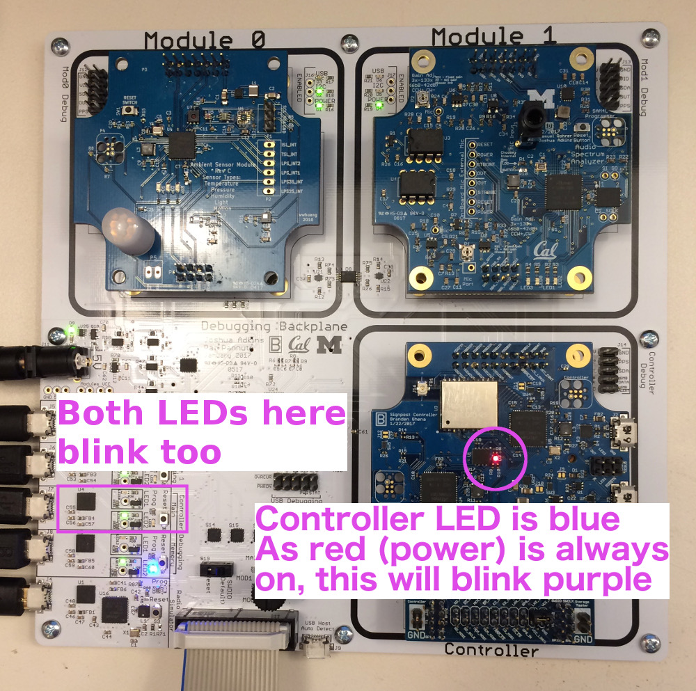

Signpost Tutorial
=================

## Get the basics working

### Toolchain setup
0. Clone repository

    ```bash
    git clone --recursive -j8 https://github.com/lab11/signpost
    ```

1. Pull submodules and repo

    ```bash
    cd signpost/
    git pull
    git submodule update --init --recursive
    ```

2. Rust

    See [Getting Started](https://github.com/helena-project/tock/blob/master/doc/Getting_Started.md)

    ```bash
    rustc --version
    ```
    must be print `rustc 1.16.0-nightly (83c2d9523 2017-01-24)` if you've got everything set up correctly.

3. arm-none-eabi-gcc

    See [Getting Started](https://github.com/helena-project/tock/blob/master/doc/Getting_Started.md)

    ```bash
    arm-none-eabi-gcc --version
    ```
    must be >= 5.2

3. JLinkExe

    You will need to install the
    [JLink](https://www.segger.com/jlink-software.html) software for your platform.
    You want the "Software and documentation pack".

    ```bash
    JLinkExe --version
    ```
    must be greater than 5

4. tockloader

    ```bash
    sudo pip3 install tockloader
    ```

5. signpost-debug-radio

    ```bash
    sudo pip2 install signpost-debug-radio
    ```

6. Check that you can compile a board

    ```bash
    cd signpost/software/kernel/boards/controller/
    make
    ```

7. Check that you can compile an app

    ```bash
    cd signpost/software/apps/tock_examples/blink/
    make
    ```


### Hardware setup

1. Collect parts

 * Debug Backplane
 * JLink programmer
 * 2x USB micro cables
 * 5v power supply
 * Control Module
    - With an Intel Edison plugged into the back
    - With an SD card in the slot on the back
 * Audio Module
 * Ambient Module

2. Attach JLink programmer

3. Plug in Control Module

4. Apply power


### Controller Kernel

1. Turn knob to `MAIN`

2. Flash the kernel

    ```bash
    cd signpost/software/kernel/boards/controller/
    make flash
    ```


### Blink app

1. Turn knob to `MAIN`


2. Flash the application

    ```bash
    cd signpost/software/apps/tock_examples/blink
    make flash
    ```

    The board should now have a blinking LED on the Control Module and two blinking
    LEDs near the USB ports.

    


### Hello app

1. Turn knob to `MAIN`

2. Connect USB cable to `Controller Main` USB port

3. Connect to serial port

    First open a new terminal window.

    ```bash
    tockloader listen -d controller
    ```

    This will open a serial terminal to the Controller. Note that nothing will print yet.
    
    > Problem? Try `pip install --upgrade tockloader`. Should be at least v0.4.0

4. Flash the application

    ```bash
    cd signpost/software/apps/tock_examples/c_hello/
    make flash
    ```

    "Hello World" should now have printed to the serial terminal.

5. Press the `Controller Main` reset button

    "Hello World" should print again!


## Playing with Tock

### What's available to Tock applications

In C, Tock applications have access to most of the [standard library
functions](http://www.cplusplus.com/reference/clibrary/). Uncommonly for
embedded systems, this includes `printf` and `malloc`/`free`. There are also
many drivers that interact with kernel code through system calls. Which
particular drivers are available on a given platform is defined in its board
`main.rs` file. For example: the [syscall connections for the ambient
board](https://github.com/lab11/signpost/blob/master/software/kernel/boards/ambient_module/src/main.rs#L91).

1. Turn knob to `MAIN`

2. Connect USB cable to `Controller Main` USB port

3. Connect to serial port

    First open a new terminal window.

    ```bash
    tockloader listen -d controller
    ```

    This will open a serial terminal to the Controller. Note that nothing will print yet.
    
    > Problem? Try `pip install --upgrade tockloader`. Should be at least v0.4.0

4. Make a new application

    ```bash
    cd signpost/software/apps/
    mkdir hello_app
    cp template/Makefile hello_app/
    touch hello_app/main.c
    cd hello_app/
    ```

5. Write code

    Open `main.c` with your favorite text editor and make it match the following:

    ```c
    #include <stdio.h>

    int main (void) {
	    printf("Starting test\n");

	    return 0;
    }
    ```

4. Flash the application

    ```bash
    make flash
    ```

    The string "Starting test" should now have printed to the serial terminal.

5. Make it repeat

    Open `main.c` with your favorite text editor and make it match the
    following and then flash it:

    ```c
    //standard library
    #include <stdio.h>
    #include <stdint.h>

    // tock library
    #include <timer.h>

    int main (void) {
	    printf("Starting test\n");

	    while (true) {
		    printf("Hello!\n");
		    delay_ms(1000);
	    }
    }
    ```

    After flashing, the string "Hello" should be printed at once second
    intervals.

### Catching application faults

The biggest advantage of using the Tock kernel is application safety. Before
starting an application, the kernel configures the microcontroller's Memory
Protection Unit (MPU) to limit the memory accesses of the app. In practice this
means that invalid memory accesses are caught by the kernel and reported to
users.


1. Make a new application

    ```bash
    cd signpost/software/apps/
    mkdir fault_test
    cp template/Makefile fault_test
    touch fault_test/main.c
    cd fault_test/
    ```

2. Write code

    Edit `main.c` to match the following and then flash it:

    ```c
    #include <stdio.h>

    int main (void) {
	    printf("Starting test\n");

	    // dereferencing null pointer
	    volatile int i = *(int*)0;

	    return 0;
    }
    ```

    A fault report should have printed.


3. Examine fault report

    The printed fault report should look a lot like this:

    ```
    Kernel panic at /home/brghena/Dropbox/repos/signpost/software/kernel/tock/kernel/src/process.rs:283:
	"Process fault_test had a fault"

    ---| Fault Status |---
    Data Access Violation:              true
    Forced Hard Fault:                  true
    Faulting Memory Address:            0x00000000
    Fault Status Register (CFSR):       0x00000082
    Hard Fault Status Register (HFSR):  0x40000000

    ---| App Status |---
    App: fault_test   -   [Fault]
     Events Queued: 0   Syscall Count: 8   Last Syscall: YIELD

     ╔═══════════╤══════════════════════════════════════════╗
     ║  Address  │ Region Name    Used | Allocated (bytes)  ║
     ╚0x2000A000═╪══════════════════════════════════════════╝
		 │ ▼ Grant         324 |   1024          
      0x20009EBC ┼┈┈┈┈┈┈┈┈┈┈┈┈┈┈┈┈┈┈┈┈┈┈┈┈┈┈┈┈┈┈┈┈┈┈┈┈┈┈┈┈┈┈
		 │ Unused
      0x200076C8 ┼┈┈┈┈┈┈┈┈┈┈┈┈┈┈┈┈┈┈┈┈┈┈┈┈┈┈┈┈┈┈┈┈┈┈┈┈┈┈┈┈┈┈
		 │ ▲ Heap         1520 |   8192                      S
      0x200070D8 ┼┈┈┈┈┈┈┈┈┈┈┈┈┈┈┈┈┈┈┈┈┈┈┈┈┈┈┈┈┈┈┈┈┈┈┈┈┈┈┈┈┈┈ R
		 │ Data            216 |    216                      A
      0x20007000 ┼┈┈┈┈┈┈┈┈┈┈┈┈┈┈┈┈┈┈┈┈┈┈┈┈┈┈┈┈┈┈┈┈┈┈┈┈┈┈┈┈┈┈ M
		 │ ▼ Stack         304 |   4096          
      0x20006ED0 ┼┈┈┈┈┈┈┈┈┈┈┈┈┈┈┈┈┈┈┈┈┈┈┈┈┈┈┈┈┈┈┈┈┈┈┈┈┈┈┈┈┈┈
		 │ Unused
      0x20006000 ┴───────────────────────────────────────────
		 .....
      0x00031000 ┬───────────────────────────────────────────
		 │ Unused
      0x00030DD0 ┼┈┈┈┈┈┈┈┈┈┈┈┈┈┈┈┈┈┈┈┈┈┈┈┈┈┈┈┈┈┈┈┈┈┈┈┈┈┈┈┈┈┈ F
		 │ Data            198                               L
      0x00030D0A ┼┈┈┈┈┈┈┈┈┈┈┈┈┈┈┈┈┈┈┈┈┈┈┈┈┈┈┈┈┈┈┈┈┈┈┈┈┈┈┈┈┈┈ A
		 │ Text           3214                               S
      0x0003007C ┼┈┈┈┈┈┈┈┈┈┈┈┈┈┈┈┈┈┈┈┈┈┈┈┈┈┈┈┈┈┈┈┈┈┈┈┈┈┈┈┈┈┈ H
		 │ Header          124
      0x00030000 ┴───────────────────────────────────────────

      R0 : 0x0000000A    R6 : 0x00000000
      R1 : 0x20007054    R7 : 0x00000000
      R2 : 0x20007000    R8 : 0x00000000
      R3 : 0x00000000    R10: 0x00000000
      R4 : 0x00000000    R11: 0x00000000
      R5 : 0x00000000    R12: 0x00000000
      R9 : 0x20007000 (Static Base Register)
      SP : 0x20006FC8 (Process Stack Pointer)
      LR : 0x00030C5F [0x80000BE2 in lst file]
      PC : 0x0003009A [0x8000001E in lst file]
     YPC : 0x000300A8 [0x8002F41A in lst file]
    ```

    * `Data Access Violation` means the app attempted to access a memory
      address it is not allowed to.

    * `Faulting Memory Address` is the address the app attempted to access.

    * `SRAM` is the volatile read/write memory space on the microcontroller.
      The application's data segment, stack, and heap live there.

    * `FLASH` is the non-volatile read-only memory space on the
      microcontroller. The application's code segment and initial data values
      live there.

### Bonus: Running two applications concurrently

Tock enables running multiple applications concurrently on a microcontroller.
The applications are handled independently and protected from each other. Many
Tock drivers are virtualized so that they can be used by multiple applications
simultaneously.

**Warning:** this functionality is relatively new and still rough. In some cases
running multiple applications will result in odd bugs and failures or simply
not fit in memory at all. While this capability is key part of future Signpost
(and Tock) development, currently use at your own risk.

1. Build the blink app

    ```bash
    cd signpost/software/apps/tock_examples/blink/
    make
    ```

2. Build your hello app

    ```bash
    cd signpost/software/apps/hello_app/
    make
    ```

3. Upload both apps

    ```bash
    cd signpost/software/
    kernel/tock/userland/tools/flash/storm-flash-app.py apps/fault_test/build/audio_module/app.bin apps/tock_examples/blink/build/storm/app.bin 
    ```

    Both apps should now be loaded on the module. The LEDs should blink and
    "Hello" should be printing to the serial terminal.


## Testing the Signpost APIs


## Ambient Module


## Multiple Modules


## Working on the Edison

