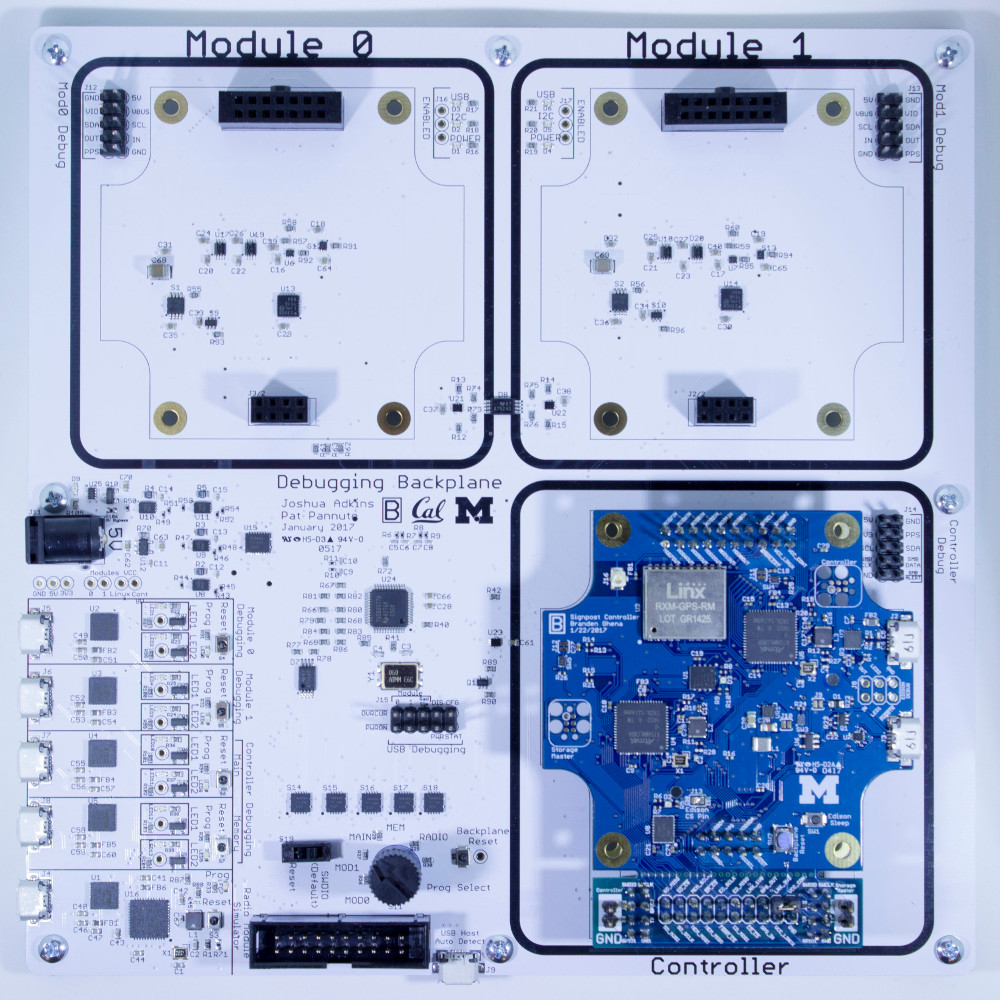
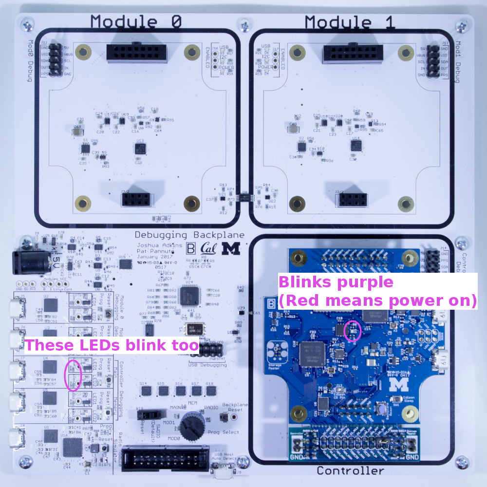
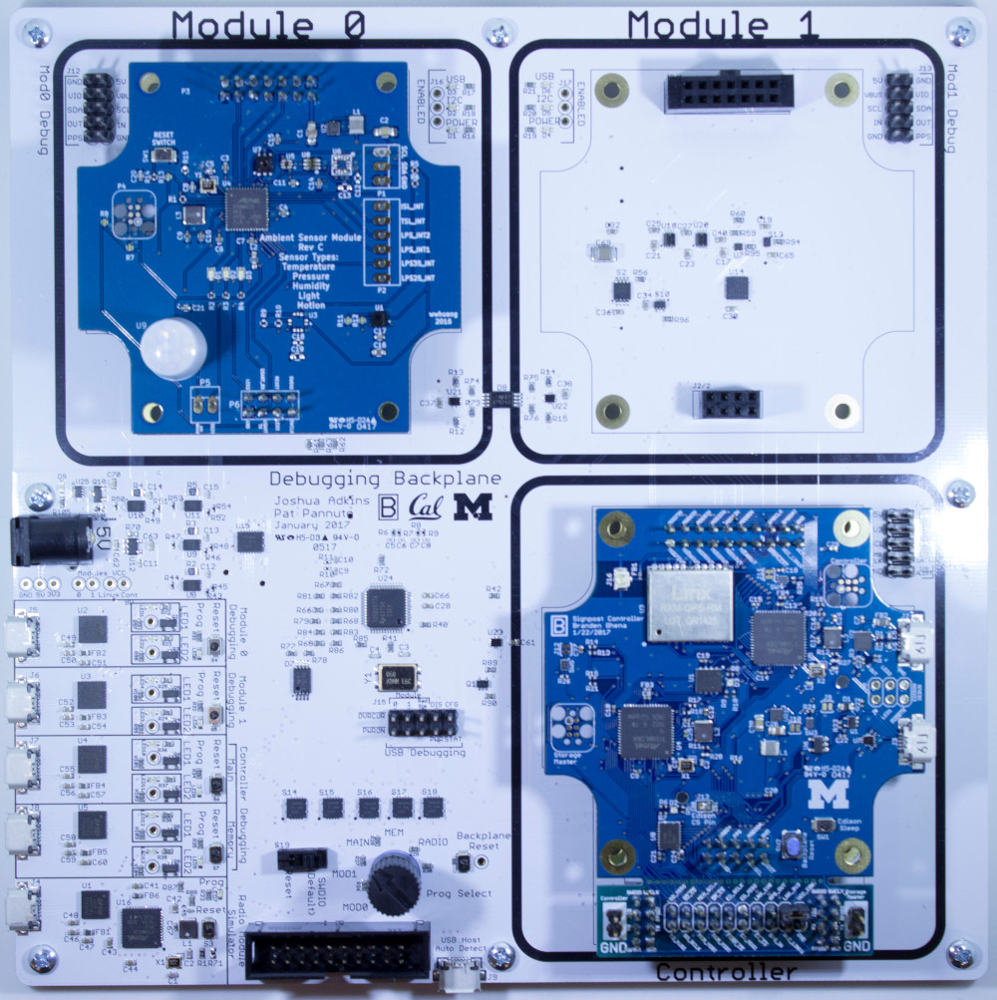
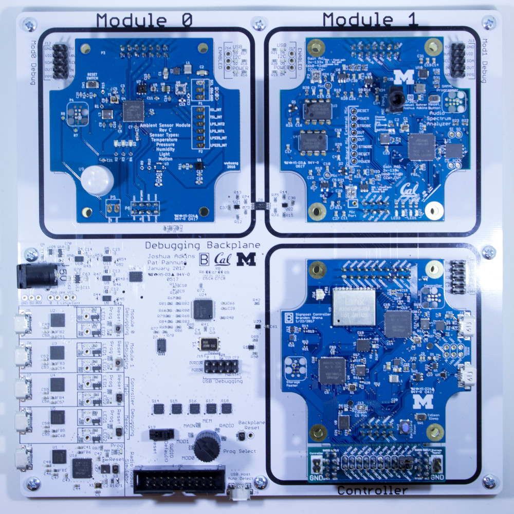

Signpost Tutorial
=================

This tutorial is intended to teach the basics of writing, building, and loading
code on the Signpost platform, how to make use of the Tock operating system,
and how to use the Signpost API.

The tutorial takes you from installing the toolchains up to writing code on
modules attached to a Signpost Debug Backplane.

## Initial Setup

### Toolchain setup
0. Clone repository

    ```bash
    git clone --recursive -j8 https://github.com/lab11/signpost
    ```

1. Pull submodules and repo

    ```bash
    cd signpost/
    git pull
    git submodule update --init --recursive
    ```

2. Rust

    See [Getting Started](https://github.com/helena-project/tock/blob/master/doc/Getting_Started.md)

    ```bash
    rustc --version
    ```
    must be print `rustc 1.16.0-nightly (83c2d9523 2017-01-24)` if you've got everything set up correctly.

3. arm-none-eabi-gcc

    See [Getting Started](https://github.com/helena-project/tock/blob/master/doc/Getting_Started.md)

    ```bash
    arm-none-eabi-gcc --version
    ```
    must be >= 5.2

3. JLinkExe

    You will need to install the
    [JLink](https://www.segger.com/jlink-software.html) software for your platform.
    You want the "Software and documentation pack".

    ```bash
    JLinkExe --version
    ```
    must be greater than 5

4. tockloader

    ```bash
    sudo pip3 install tockloader
    ```

5. signpost-debug-radio

    ```bash
    sudo pip2 install signpost-debug-radio
    ```

6. Check that you can compile a board

    ```bash
    cd signpost/software/kernel/boards/controller/
    make
    ```

7. Check that you can compile an app

    ```bash
    cd signpost/software/apps/tock_examples/blink/
    make
    ```


### Hardware setup

1. Collect parts

 * Debug Backplane
 * JLink programmer
 * 2x USB micro cables
 * 5v power supply
 * Control Module
    - With an Intel Edison plugged into the back
    - With an SD card in the slot on the back
 * Audio Module
 * Ambient Module

2. Attach JLink programmer

3. Plug in Control Module

    

4. Apply power


## Dealing with problems

From here on out, you will definitely run into problems. This is research
hardware and software still in its infancy. We really appreciate your patience.

If everything is not working, try resetting modules and then the `Controller
Main`. Power cycling the entire board is a valid option too.

Module Initialization can take several seconds to complete. The Controller
should print the following once Initialization for a module is complete.

```
Module 0 granted isolation
INIT: Registered address 0x51 as module 0
```

The Green Debug LED should be on for both modules. The Red Debug LED should
be on before Initialization has completed and off afterwards. A blinking
pattern on the Red Debug LED signifies that the application has crashed.

Let us know if you're having problems and we will help out.


## Get the basics working

### Controller Kernel

1. Turn knob to `MAIN`

2. Flash the kernel

    ```bash
    cd signpost/software/kernel/boards/controller/
    make flash
    ```

### Blink app

1. Turn knob to `MAIN`


2. Flash the application

    ```bash
    cd signpost/software/apps/tock_examples/blink
    make flash
    ```

    The board should now have a blinking LED on the Control Module and two blinking
    LEDs near the USB ports.

    

### Hello app

1. Turn knob to `MAIN`

2. Connect USB cable to `Controller Main` USB port

3. Connect to serial port

    First open a new terminal window.

    ```bash
    tockloader listen -d controller
    ```

    This will open a serial terminal to the Controller. Note that nothing will print yet.
    
    > Problem? Try `pip install --upgrade tockloader`. Should be at least v0.4.0

4. Flash the application

    **Note:** we do not need to re-flash the Controller kernel. The kernel can
    remains on the microcontroller even as apps change.

    ```bash
    cd signpost/software/apps/tock_examples/c_hello/
    make flash
    ```

    "Hello World" should now have printed to the serial terminal.

5. Press the `Controller Main` reset button

    "Hello World" should print again!


## Playing with Tock

### What's available to Tock applications

In C, Tock applications have access to most of the [standard library
functions](http://www.cplusplus.com/reference/clibrary/). Uncommonly for
embedded systems, this includes `printf` and `malloc`/`free`. There are also
many drivers that interact with kernel code through system calls. Which
particular drivers are available on a given platform is defined in its board
`main.rs` file. For example: the [syscall connections for the ambient
board](https://github.com/lab11/signpost/blob/master/software/kernel/boards/ambient_module/src/main.rs#L91).

1. Turn knob to `MAIN`

2. Connect USB cable to `Controller Main` USB port

3. Connect to serial port

    First open a new terminal window.

    ```bash
    tockloader listen -d controller
    ```

    This will open a serial terminal to the Controller. Note that nothing will print yet.
    
    > Problem? Try `pip install --upgrade tockloader`. Should be at least v0.4.0

4. Make a new application

    ```bash
    cd signpost/software/apps/
    mkdir hello_app
    cp template/Makefile hello_app/
    touch hello_app/main.c
    cd hello_app/
    ```

5. Write code

    Open `main.c` with your favorite text editor and make it match the following:

    ```c
    #include <stdio.h>

    int main (void) {
	    printf("Starting test\n");

	    return 0;
    }
    ```

4. Flash the application

    ```bash
    make flash
    ```

    The string "Starting test" should now have printed to the serial terminal.

5. Make it repeat

    Open `main.c` with your favorite text editor and make it match the
    following and then flash it:

    ```c
    //standard library
    #include <stdio.h>
    #include <stdint.h>

    // tock library
    #include <timer.h>

    int main (void) {
	    printf("Starting test\n");

	    while (true) {
		    printf("Hello!\n");
		    delay_ms(1000);
	    }
    }
    ```

    After flashing, the string "Hello" should be printed at once second
    intervals.

### Catching application faults

The biggest advantage of using the Tock kernel is application safety. Before
starting an application, the kernel configures the microcontroller's Memory
Protection Unit (MPU) to limit the memory accesses of the app. In practice this
means that invalid memory accesses are caught by the kernel and reported to
users.


1. Make a new application

    ```bash
    cd signpost/software/apps/
    mkdir fault_test
    cp template/Makefile fault_test
    touch fault_test/main.c
    cd fault_test/
    ```

2. Write code

    Edit `main.c` to match the following and then flash it:

    ```c
    #include <stdio.h>

    int main (void) {
	    printf("Starting test\n");

	    // dereferencing null pointer
	    volatile int i = *(int*)0;

	    return 0;
    }
    ```

    A fault report should have printed.


3. Examine fault report

    The printed fault report should look a lot like this:

    ```
    Kernel panic at /home/brghena/Dropbox/repos/signpost/software/kernel/tock/kernel/src/process.rs:283:
	"Process fault_test had a fault"

    ---| Fault Status |---
    Data Access Violation:              true
    Forced Hard Fault:                  true
    Faulting Memory Address:            0x00000000
    Fault Status Register (CFSR):       0x00000082
    Hard Fault Status Register (HFSR):  0x40000000

    ---| App Status |---
    App: fault_test   -   [Fault]
     Events Queued: 0   Syscall Count: 8   Last Syscall: YIELD

     ╔═══════════╤══════════════════════════════════════════╗
     ║  Address  │ Region Name    Used | Allocated (bytes)  ║
     ╚0x2000A000═╪══════════════════════════════════════════╝
		 │ ▼ Grant         324 |   1024          
      0x20009EBC ┼┈┈┈┈┈┈┈┈┈┈┈┈┈┈┈┈┈┈┈┈┈┈┈┈┈┈┈┈┈┈┈┈┈┈┈┈┈┈┈┈┈┈
		 │ Unused
      0x200076C8 ┼┈┈┈┈┈┈┈┈┈┈┈┈┈┈┈┈┈┈┈┈┈┈┈┈┈┈┈┈┈┈┈┈┈┈┈┈┈┈┈┈┈┈
		 │ ▲ Heap         1520 |   8192                      S
      0x200070D8 ┼┈┈┈┈┈┈┈┈┈┈┈┈┈┈┈┈┈┈┈┈┈┈┈┈┈┈┈┈┈┈┈┈┈┈┈┈┈┈┈┈┈┈ R
		 │ Data            216 |    216                      A
      0x20007000 ┼┈┈┈┈┈┈┈┈┈┈┈┈┈┈┈┈┈┈┈┈┈┈┈┈┈┈┈┈┈┈┈┈┈┈┈┈┈┈┈┈┈┈ M
		 │ ▼ Stack         304 |   4096          
      0x20006ED0 ┼┈┈┈┈┈┈┈┈┈┈┈┈┈┈┈┈┈┈┈┈┈┈┈┈┈┈┈┈┈┈┈┈┈┈┈┈┈┈┈┈┈┈
		 │ Unused
      0x20006000 ┴───────────────────────────────────────────
		 .....
      0x00031000 ┬───────────────────────────────────────────
		 │ Unused
      0x00030DD0 ┼┈┈┈┈┈┈┈┈┈┈┈┈┈┈┈┈┈┈┈┈┈┈┈┈┈┈┈┈┈┈┈┈┈┈┈┈┈┈┈┈┈┈ F
		 │ Data            198                               L
      0x00030D0A ┼┈┈┈┈┈┈┈┈┈┈┈┈┈┈┈┈┈┈┈┈┈┈┈┈┈┈┈┈┈┈┈┈┈┈┈┈┈┈┈┈┈┈ A
		 │ Text           3214                               S
      0x0003007C ┼┈┈┈┈┈┈┈┈┈┈┈┈┈┈┈┈┈┈┈┈┈┈┈┈┈┈┈┈┈┈┈┈┈┈┈┈┈┈┈┈┈┈ H
		 │ Header          124
      0x00030000 ┴───────────────────────────────────────────

      R0 : 0x0000000A    R6 : 0x00000000
      R1 : 0x20007054    R7 : 0x00000000
      R2 : 0x20007000    R8 : 0x00000000
      R3 : 0x00000000    R10: 0x00000000
      R4 : 0x00000000    R11: 0x00000000
      R5 : 0x00000000    R12: 0x00000000
      R9 : 0x20007000 (Static Base Register)
      SP : 0x20006FC8 (Process Stack Pointer)
      LR : 0x00030C5F [0x80000BE2 in lst file]
      PC : 0x0003009A [0x8000001E in lst file]
     YPC : 0x000300A8 [0x8002F41A in lst file]
    ```

    * `Data Access Violation` means the app attempted to access a memory
      address it is not allowed to.

    * `Faulting Memory Address` is the address the app attempted to access.

    * `SRAM` is the volatile read/write memory space on the microcontroller.
      The application's data segment, stack, and heap live there.

    * `FLASH` is the non-volatile read-only memory space on the
      microcontroller. The application's code segment and initial data values
      live there.

### Bonus: Running two applications concurrently

Tock enables running multiple applications concurrently on a microcontroller.
The applications are handled independently and protected from each other. Many
Tock drivers are virtualized so that they can be used by multiple applications
simultaneously.

**Warning:** this functionality is relatively new and still rough. In some cases
running multiple applications will result in odd bugs and failures or simply
not fit in memory at all. While this capability is key part of future Signpost
(and Tock) development, currently use at your own risk.

1. Build the blink app

    ```bash
    cd signpost/software/apps/tock_examples/blink/
    make
    ```

2. Build your hello app

    ```bash
    cd signpost/software/apps/hello_app/
    make
    ```

3. Upload both apps

    ```bash
    cd signpost/software/
    kernel/tock/userland/tools/flash/storm-flash-app.py apps/fault_test/build/audio_module/app.bin apps/tock_examples/blink/build/storm/app.bin 
    ```

    Both apps should now be loaded on the module. The LEDs should blink and
    "Hello" should be printing to the serial terminal.


## Testing the Signpost APIs

[API Documentation](https://github.com/lab11/signpost/blob/master/software/docs/ApiGuide.md)

### Set up the Signpost platform

1. Flash the Storage Master kernel

    **Important** Make sure the programming knob is turned to `MEM`.

    ```bash
    cd signpost/software/kernel/boards/storage_master/
    make flash
    ```

2. Flash the Signpost Storage Master app

    ```bash
    cd signpost/software/apps/storage_master/signpost_storage_master
    make flash
    ```

3. View Storage Master output

    Connect a USB cable to the `Memory` USB plug.

    ```bash
    tockloader listen -d storage
    ```

    Hit the `Memory` reset button. (Near the USB plug)

    A message should print that the Storage Master has detected an SD card and
    initialized it.

3. Flash the Signpost Controller app

    **Important** Make sure the programming knob is turned to `MAIN`.

    ```bash
    cd signpost/software/apps/controller/signpost_controller_app/
    make flash
    ```

4. View Controller output

    Connect a USB cable to the `Main` USB plug.

    ```bash
    tockloader listen -d controller
    ```

    Hit the `Controller Main` reset button.

    The Controller should print GPS updates once per second. GPS doesn't get a
    fix indoors (or without an antenna) unfortunately, but the GPS module
    starts with a default timestamp which it updates once per second.
    ```
    GPS Data: 1:56:02.2000 1/6/80
      Latitude:   0 degrees
      Longitude:  0 degrees
      Status:     Invalid fix
      Satellites: 0
    ```

    **Note:** we do have some GPS antennas with long cables which you can test
    with if they are not in use. Flag us down.

    Once every ten seconds it prints an Energy use update:
    ```
    Energy Data
      Module 0 energy:            0 uAh
      Module 1 energy:            0 uAh
      Controller energy:       5624 uAh
      Linux energy:               0 uAh
    ```

5. Flash the Debug Radio Module kernel

    **Important** Make sure the programming knob is turned to `RADIO`.

    ```bash
    cd signpost/software/kernel/boards/debug_radio_module/
    make flash
    ```

6. Flash the Signpost Debug Radio Module app

    ```bash
    cd signpost/software/apps/debug_radio_module/signpost_debug_radio_app/
    make flash
    ```

### Set up the Ambient Module



1. Plug the Ambient Module into the `Module 0` slot

2. Flash the Ambient Module kernel

    **Important** Make sure the programming knob is turned to `MOD0`.

    ```bash
    cd signpost/software/kernel/boards/ambient_module/
    make flash
    ```

3. Flash the hello app

    ```bash
    cd signpost/software/apps/hello_app/
    make flash
    ```

4. View Ambient output

    Connect a USB cable to the `Module 0` USB plug.

    ```bash
    tockloader listen -d module0
    ```

    Hit the `Module 0` reset button.

### Test the Time and Location API

[Time and Location API docs](https://github.com/lab11/signpost/blob/master/software/docs/ApiGuide.md#time)

1. Look at the example code

    [API Time and Location Test](https://github.com/lab11/signpost/blob/master/software/apps/tests/api_timelocation_test/main.c)

2. Flash the Time and Location test app

    **Important** Make sure the programming knob is turned to `MOD0`.

    ```bash
    cd signpost/software/apps/tests/api_timelocation_test/
    make flash
    ```

    Hit the `Module 0` reset button.

3. Open serial connections

    Connect USB cables to both the `Controller Main` and `Module 0` USB plugs.

    In one terminal window:
    ```bash
    tockloader listen -d controller
    ```

    In another terminal window:
    ```bash
    tockloader listen -d module0
    ```

4. Data output

    If everything is successful, every five seconds `Module 0` should print
    something resembling:
    ```
    Query Time
      Current time: 2080/1/6 3:38:46 with 0 satellites
    Query Location
      Current location:
	Latitude:   0
	Longitude:  0
      With 0 satellites
    Sleeping for 5s
    ```

### Test the Storage API

[Storage API docs](https://github.com/lab11/signpost/blob/master/software/docs/ApiGuide.md#time)

1. Look at the example code

    [API Storage Test](https://github.com/lab11/signpost/blob/master/software/apps/tests/api_storage_test/main.c)

2. Flash the Storage test app

    **Important** Make sure the programming knob is turned to `MOD0`.

    ```bash
    cd signpost/software/apps/tests/api_storage_test/
    make flash
    ```

    Hit the `Module 0` reset button.

3. Open serial connections

    Connect USB cables to both the `Memory` and `Module 0` USB plugs.

    In one terminal window:
    ```bash
    tockloader listen -d storage
    ```

    In another terminal window:
    ```bash
    tockloader listen -d module0
    ```

4. Data output

    If everything is successful, every seconds `Module 0` should print
    something resembling:
    ```
    Writing buffer [9]*600
    Wrote successfully! Block: 188 Offset: 358
    ```

    And the `Memory` serial interface should print something like:
    ```
    Complete. Final block: 218 offset: 123 Got a command message!: len = 600 7B
    7B 7B 7B 7B 7B 7B 7B 7B 7B 7B 7B 7B 7B 7B 7B 7B 7B 7B 7B 7B 7B 7B 7B 7B 7B
    7B 7B 7B 7B 7B 7B 7B 7B 7B 7B 7B 7B 7B 7B 7B 7B 7B 7B 7B 7B 7B 7B 7B 7B 7B
    7B 7B 7B 7B 7B 7B 7B 7B 7B 7B 7B 7B 7B 7B 7B 7B 7B 7B 7B 7B 7B 7B 7B 7B 7B
    7B 7B 7B 7B 7B 7B 7B 7B 7B 7B 7B 7B 7B 7B 7B 7B 7B 7B 7B 7B 7B 7B 7B 7B 7B
    7B 7B 7B 7B 7B 7B 7B 7B 7B 7B 7B 7B 7B 7B 7B 7B 7B 7B 7B 7B 7B 7B 7B 7B 7B
    7B 7B 7B 7B 7B 7B 7B 7B 7B 7B 7B 7B 7B 7B 7B 7B 7B 7B 7B 7B 7B 7B 7B 7B 7B
    7B 7B 7B 7B 7B 7B 7B 7B 7B 7B 7B 7B 7B 7B 7B 7B 7B 7B 7B 7B 7B 7B 7B 7B 7B
    7B 7B 7B 7B 7B 7B 7B 7B 7B 7B 7B 7B 7B 7B 7B 7B 7B 7B 7B 7B 7B 7B 7B 7B 7B
    7B 7B 7B 7B 7B 7B 7B 7B 7B 7B 7B 7B 7B 7B 7B 7B 7B 7B 7B 7B 7B 7B 7B 7B 7B
    7B 7B 7B 7B 7B 7B 7B 7B 7B 7B 7B 7B 7B 7B 7B 7B 7B 7B 7B 7B 7B 7B 7B 7B 7B
    7B 7B 7B 7B 7B 7B 7B 7B 7B 7B 7B 7B 7B 7B 7B 7B 7B 7B 7B 7B 7B 7B 7B 7B 7B
    7B 7B 7B 7B 7B 7B 7B 7B 7B 7B 7B 7B 7B 7B 7B 7B 7B 7B 7B 7B 7B 7B 7B 7B 7B
    7B 7B 7B 7B 7B 7B 7B 7B 7B 7B 7B 7B 7B 7B 7B 7B 7B 7B 7B 7B 7B 7B 7B 7B 7B
    7B 7B 7B 7B 7B 7B 7B 7B 7B 7B 7B 7B 7B 7B 7B 7B 7B 7B 7B 7B 7B 7B 7B 7B 7B
    7B 7B 7B 7B 7B 7B 7B 7B 7B 7B 7B 7B 7B 7B 7B 7B 7B 7B 7B 7B 7B 7B 7B 7B 7B
    7B 7B 7B 7B 7B 7B 7B 7B 7B 7B 7B 7B 7B 7B 7B 7B 7B 7B 7B 7B 7B 7B 7B 7B 7B
    7B 7B 7B 7B 7B 7B 7B 7B 7B 7B 7B 7B 7B 7B 7B 7B 7B 7B 7B 7B 7B 7B 7B 7B 7B
    7B 7B 7B 7B 7B 7B 7B 7B 7B 7B 7B 7B 7B 7B 7B 7B 7B 7B 7B 7B 7B 7B 7B 7B 7B
    7B 7B 7B 7B 7B 7B 7B 7B 7B 7B 7B 7B 7B 7B 7B 7B 7B 7B 7B 7B 7B 7B 7B 7B 7B
    7B 7B 7B 7B 7B 7B 7B 7B 7B 7B 7B 7B 7B 7B 7B 7B 7B 7B 7B 7B 7B 7B 7B 7B 7B
    7B 7B 7B 7B 7B 7B 7B 7B 7B 7B 7B 7B 7B 7B 7B 7B 7B 7B 7B 7B 7B 7B 7B 7B 7B
    7B 7B 7B 7B 7B 7B 7B 7B 7B 7B 7B 7B 7B 7B 7B 7B 7B 7B 7B 7B 7B 7B 7B 7B 7B
    7B 7B 7B 7B 7B 7B 7B 7B 7B 7B 7B 7B 7B 7B 7B 7B 7B 7B 7B 7B 7B 7B 7B 7B 7B
    7B 7B 7B 7B 7B 7B 7B 7B 7B 7B 7B 7B 7B 7B 7B 7B 7B 7B 7B 7B 7B 7B 7B 7B
    Writing data
    ```

### Test the Networking API

[Networking API docs](https://github.com/lab11/signpost/blob/master/software/docs/ApiGuide.md#networking)

1. Look at the example code

    [API Simple Networking Test](https://github.com/lab11/signpost/blob/master/software/apps/tests/api_simple_networking_test/main.c)

2. Flash the Networking test app

    **Important** Make sure the programming knob is turned to `MOD0`.

    ```bash
    cd signpost/software/apps/tests/api_simple_networking_test/
    make flash
    ```

    Hit the `Module 0` reset button.

3. View Ambient output

    Connect USB cables to both the `Radio` and `Module 0` USB plugs.

    In one terminal window:
    ```bash
    tockloader listen -d module0
    ```

4. Start the Debug Radio script

    In another terminal window:
    ```bash
    signpost-debug-radio
    ```

5. Data output

    If everything is successful, every five seconds `signpost-debug-radio`
    should print something like:
    ```
    #######################################################
    Trying to post to httpbin.org/post
    Post headers: {u'content-length': u'20', u'content-type': u'application/octet-stream'}
    Post body: <binary data, length 20>
      27 03 03 00 00 40 00 20 88 69 00 20 00 bf 00 20 00 00 00 00

    Post Succeeded! See response below.
    Status: 200, Reason: OK
    Body: {
      "args": {}, 
      "data": "data:application/octet-stream;base64,JwMDAABAACCIaQAgAL8AIAAAAAA=", 
      "files": {}, 
      "form": {}, 
      "headers": {
	"Accept-Encoding": "identity", 
	"Content-Length": "20", 
	"Content-Type": "application/octet-stream", 
	"Host": "httpbin.org"
      }, 
      "json": null, 
      "origin": "141.212.11.236", 
      "url": "http://httpbin.org/post"
    }


    Sending response back to radio
    #######################################################
    ```

    And the `Module 0` serial terminal should print:
    ```
    Append successful
    ```


## Ambient Module

### Create base app

Let's start with an app that samples sensors periodically and add signpost
features.

1. Make a new application

    ```bash
    cd signpost/software/apps/
    mkdir ambient_test/
    cp template/Makefile ambient_test/
    touch ambient_test/main.c
    cd ambient_test/
    ```

2. Write code

    Open `main.c` with your favorite text editor and make it match the following:

    ```c
    // standard library
    #include <stdio.h>

    // tock includes
    #include <led.h>
    #include <isl29035.h>
    #include <si7021.h>
    #include <timer.h>
    #include <tock.h>

    // signpost includes
    #include "signpost_api.h"

    // module-specific settings
    #define AMBIENT_MODULE_I2C_ADDRESS 0x32
    #define AMBIENT_LED1 2

    static void sample_sensors (void) {
	  // read data from sensors and save locally
	  int err_code;

	  // get light
	  int light = 0;
	  err_code = isl29035_read_light_intensity();
	  if (err_code < SUCCESS) {
		printf("Error reading from light sensor: %d\n", light);
	  } else {
		light = err_code;
		err_code = SUCCESS;
	  }

	  // get temperature and humidity
	  int temperature = 0;
	  unsigned humidity = 0;
	  int err = si7021_get_temperature_humidity_sync(&temperature, &humidity);
	  if (err < SUCCESS) {
		printf("Error reading from temperature/humidity sensor: %d\n", err);
		err_code = err;
	  }

	  // print readings
	  printf("--Sensor readings--\n");
	  printf("\tTemperature %d (degrees C * 100)\n", temperature);
	  printf("\tHumidity %d (%%RH * 100)\n", humidity);
	  printf("\tLight %d (lux)\n", light);
    }

    int main (void) {
      printf("\n[Ambient Module] Test App\n");

      // initialize module as a part of the signpost bus
      int rc;
      do {
	    rc = signpost_initialization_module_init(AMBIENT_MODULE_I2C_ADDRESS, NULL);
	    if (rc < 0) {
		  printf(" - Error initializing bus (code %d). Sleeping for 5s\n", rc);
		  delay_ms(5000);
	    }
      } while (rc < 0);
      printf(" * Bus initialized\n");

      // perform main application
      while (true) {
	    // sample from onboard sensors
	    sample_sensors();

	    // sleep for a bit
	    delay_ms(3000);
      }
    }
    ```

### Add signpost APIs to it

This part is more open-ended. Play around. Add some Signpost APIs as seems
appropriate.


## Audio Module



### Set up Audio Module

1. Plug the Audio Module into the `Module 1` slot

2. Flash the Audio Module kernel

    **Important** Make sure the programming knob is turned to `MOD1`.

    ```bash
    cd signpost/software/kernel/boards/audio_module/
    make flash
    ```

3. Flash the hello app

    ```bash
    cd signpost/software/apps/hello_apps/
    make flash
    ```

4. View Audio output

    Connect a USB cable to the `Module 1` USB plug.

    ```bash
    tockloader listen -d module1
    ```

    Hit the `Module 1` reset button.

### Create base app

Lets start with an app that samples audio data periodically and add signpost
features.

1. Make a new application

    ```bash
    cd signpost/software/apps/
    mkdir audio_test/
    cp template/Makefile audio_test/
    touch audio_test/main.c
    cd audio_test/
    ```

2. Write code

    Open `main.c` with your favorite text editor and make it match the following:

    ```c
    // standard library
    #include <stdio.h>

    // tock includes
    #include <adc.h>
    #include <timer.h>
    #include <tock.h>

    // signpost includes
    #include "signpost_api.h"

    static const uint8_t i2c_address = 0x33;

    int main (void) {
	  printf("[Audio Module] Test App\n");

	  // initialize the signpost bus
	  int rc;

	  do {
		rc = signpost_initialization_module_init(i2c_address, SIGNPOST_INITIALIZATION_NO_APIS);
		if (rc < 0) {
		  printf(" - Error initializing bus (code: %d). Sleeping 5s\n", rc);
		  delay_ms(5000);
		}
	  } while (rc < 0);

	  // initialize ADC
	  int err = adc_initialize();
	  if (err < SUCCESS) {
		printf("ADC initialization errored: %d\n", err);
	  }

	  printf("Sampling data\n");
	  while (true) {

		// read data from ADC
		err = adc_read_single_sample(3);
		if (err < SUCCESS) {
		  printf("ADC read error: %d\n", err);
		} else {
		  // print sample data
		  printf("%d\n", err);
		}
	  }
    }
    ```

### Add signpost APIs to it

This part is more open-ended. Play around. Add some Signpost APIs as seems
appropriate.


## The End

That's the end of this tutorial guide. Time to play around with any ideas this
gave you. Think about what apps the Signpost APIs enable and what kind of APIs
you need to run apps you are interested in.

